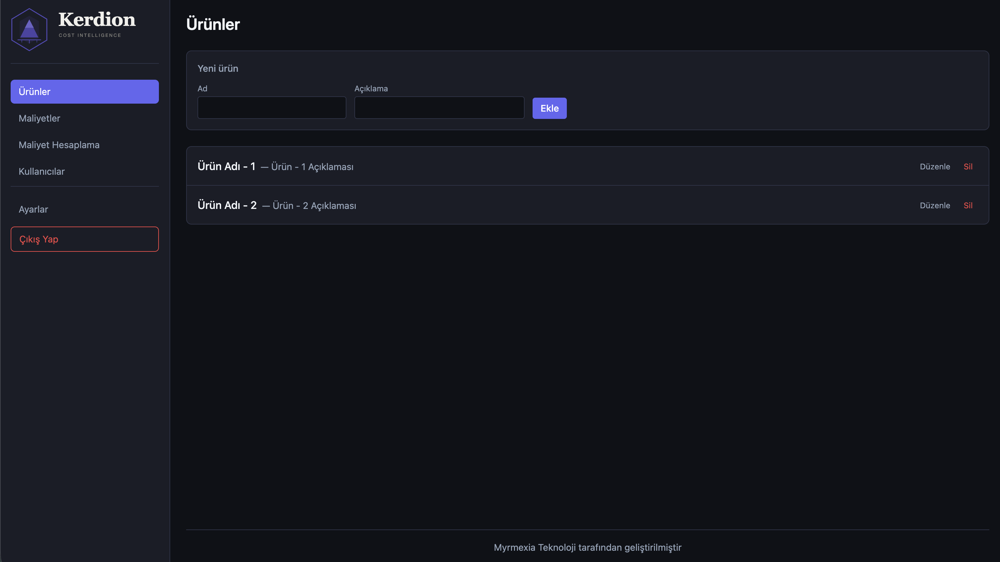
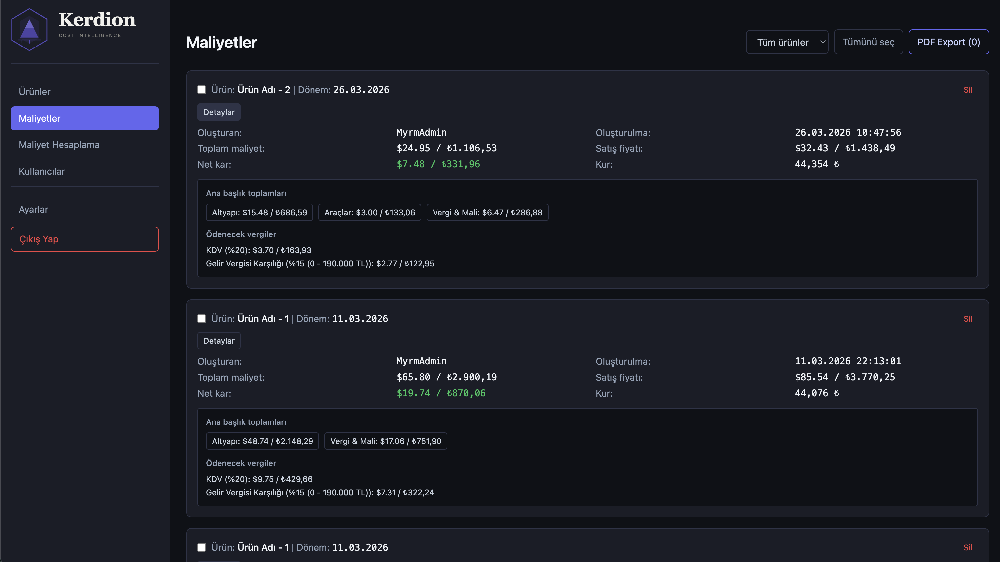
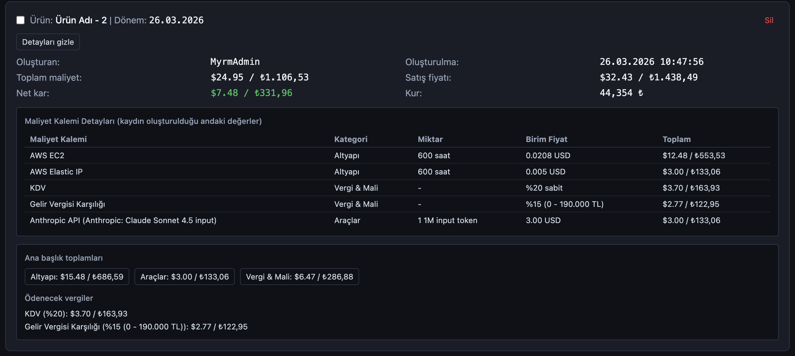
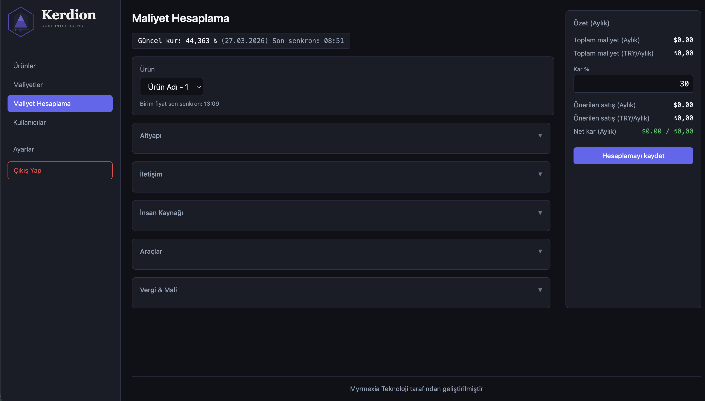
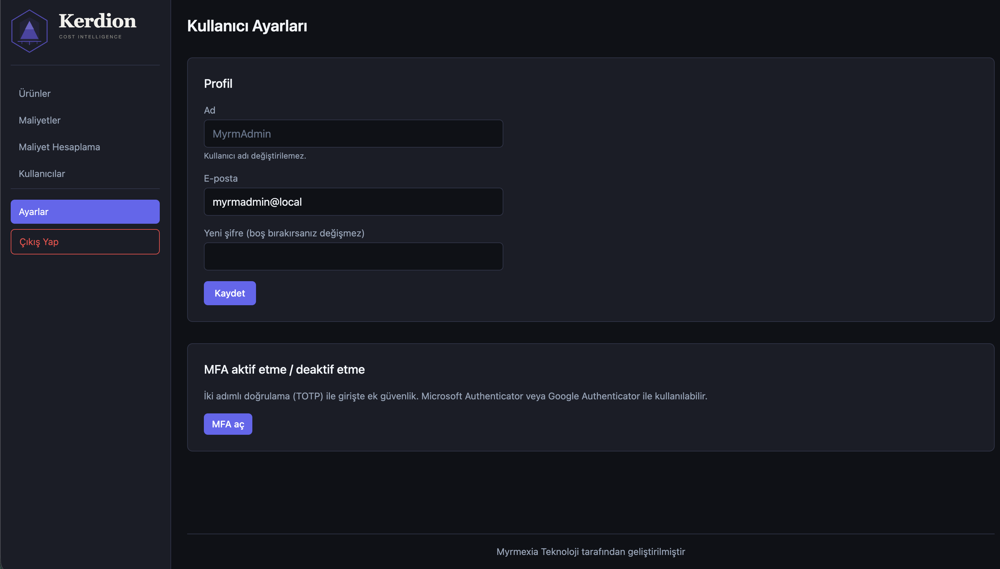

# Kerdion v2

Startup kurucuları için açık kaynaklı maliyet hesaplama aracı. AWS altyapı maliyetlerini, AI API ücretlerini, vergi yükünü ve kur etkisini tek bir hesaplamada birleştirir.


---

## Ne Yapar?

- **Canlı fiyat çekimi** — AWS EC2, RDS, S3, CloudFront ve diğer servislerin birim fiyatlarını API'den çeker
- **AI API maliyetleri** — OpenAI ve Anthropic tüm modeller, anlık birim fiyatlarıyla
- **Türkiye vergi hesabı** — KDV %20, gelir vergisi dilimleri, SSK + işsizlik işveren payı
- **USD / TRY dönüşümü** — anlık kur ile tüm hesaplamalar hem dolar hem lira bazında
- **Fiyatlandırma önerisi** — kar marjı gir, önerilen satış fiyatını al
- **Hesaplama kaydetme** — geçmiş dönem kayıtlarını sakla ve karşılaştır
- **PDF export** — hesaplamayı PDF olarak dışa aktar

---

## Ekran Görüntüleri







---

## Dokümantasyon

Teknik detaylar, hesaplama mantığı, vergi dilimleri ve AWS entegrasyonu için:

[docs/DEVELOPMENT.md](docs/DEVELOPMENT.md)

---

## Kurulum

### Gereksinimler

- Docker
- Docker Compose

### Adımlar

**1. Repoyu klonla:**

```bash
git clone https://github.com/myrmexia-org/kerdion.git
cd kerdion-v2
```

**2. `.env` dosyasını oluştur:**

```bash
cp .env.example .env
```

`.env` dosyasını düzenle:

```env
POSTGRES_USER=kerdion_user
POSTGRES_PASSWORD=guclu_bir_sifre
POSTGRES_DB=kerdion_db
DATABASE_URL=postgresql://kerdion_user:guclu_bir_sifre@db:5432/kerdion_db
SECRET_KEY=guclu_bir_secret_key
```

**3. Docker Compose ile başlat:**

```bash
docker-compose up -d
```

**4. İlk kullanıcıyı oluştur:**

```bash
docker exec -it cost-calculator-v2-backend-1 python3 -c "
import bcrypt
import psycopg2
import os

password = 'sifreniz'
hashed = bcrypt.hashpw(password.encode(), bcrypt.gensalt()).decode()

conn = psycopg2.connect(os.environ['DATABASE_URL'])
cur = conn.cursor()
cur.execute(\"INSERT INTO users (name, email, password_hash) VALUES (%s, %s, %s)\", ('admin', 'admin@example.com', hashed))
conn.commit()
cur.close()
conn.close()
print('Kullanici olusturuldu')
"
```

**5. Tarayıcıda aç:**

```
http://localhost
```

---

## Teknolojiler

| Katman | Teknoloji |
|--------|-----------|
| Backend | Python, FastAPI |
| Frontend | React, Vite, Tailwind CSS |
| Veritabanı | PostgreSQL |
| Altyapı | Docker, Nginx |

---

## Desteklenen Servisler

### Altyapı (AWS)
EC2, RDS, S3, CloudFront, Bandwidth, Route53, CloudWatch, Backup, NAT Gateway, Elastic IP, Secrets Manager, SES, Lambda, ElastiCache

### AI / Araçlar
OpenAI (tüm modeller), Anthropic Claude (tüm modeller), GitHub, Sentry, SendGrid

### Vergi & Mali (Türkiye)
KDV, Gelir Vergisi, SSK + İşsizlik (işveren payı)

---

## Hosted Versiyon

Kerdion v2'yi kendi sunucuna kurmak yerine hazır kullanmak istiyorsan:

**Kerdion** — yakında yayında

---

## Lisans

MIT

---

## Geliştiren

Myrmexia Teknoloji
